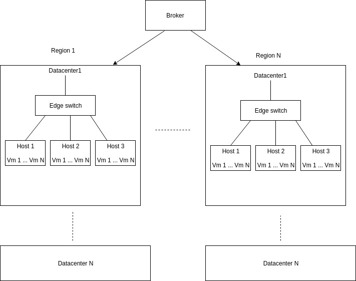

#Creating and evaluating Cloud Provider simulations

##Prerequisites
* Scala `2.12.8`
* SBT
* Docker

##Setting up
This project can be setup on your local device by either of the following ways:
* Import project as SBT project
* Clone this git repo using:
    `git clone https://chinmay2312@bitbucket.org/chinmay2312/chinmay_gangal_project.git`

##Project structure
* Code
    * Resources
        This contains the configuration files
    * Scala : This contains all the source code
        * `cloudsimplus.extension`
            Contains extended entities from CloudSimPlus & additional functionalities
        * `com.uic.cs441.project`
            * `config`: Read config files
            * `generator`: Generates various cloudsim entities
            * `regions`: Contains the definition for regions
            * `MainApp`: **The Main class**
* Tests: Contains tests for various modules from source code
    * `AppTest`: Integration test

##Steps to run
* Launch terminal & navigate project root level
* The input configuration can be customised in the file `application.conf`
* Run the command `sbt "runMain com.uic.cs441.project.MainApp"`
* The output would be presented in the terminal itself, as a summary table for each input cloudlet

##How to download the docker image

Docker commands to build image and container

1. The following generates a docker image locally
sbt docker: publishLocal
   
2. The following publishes a docker image to the hub (Repository adarsh23)
sbt docker: publish
   
3. Creates a container when run within the project root directory
docker-compose up
   
How to run using global docker image
a. Install docker
b. docker pull adarsh23/regionalcloudsim:latest
c. docker run adarsh23/regionalcloudsim

The above command will execute the app

##Diagram of the network topology

##Authors
* Adarsh Hegde
* Amrish Jhaveri
* Chinmay Gangal
* Karan Kadakia
